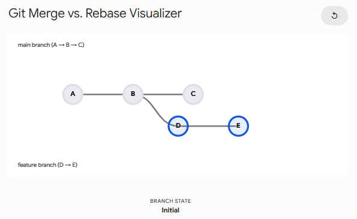
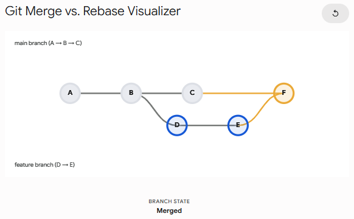
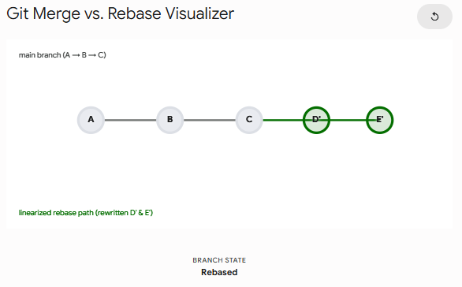

# 🚀 Ultimate Git & GitHub Reference Guide

A comprehensive reference guide for Git version control and GitHub workflow fundamentals.

---

## 📌 Table of Contents

1. [The Core Mental Model](#1-the-core-mental-model)
2. [Installation & Configuration](#2-installation--configuration)
3. [Daily Command Glossary](#3-the-daily-command-glossary)
4. [Setting Up a Clean Repository](#4-setting-up-a-clean-repository)
5. [Branching, Merging & Resolving Conflicts](#5-branching-merging--resolving-conflicts)
6. [Connecting to GitHub & Remote Repositories](#6-connecting-to-github--remote-repositories)
7. [Git Merge vs. Git Rebase](#7-git-merge-vs-git-rebase)
8. [Resolving Conflicts During a Rebase](#8-resolving-conflicts-during-a-rebase)
9. [Unstaging Files](#9-unstaging-files)
10. [Undoing Commits (`git reset`)](#10-undoing-commits-git-reset)

---

## 1. The Core Mental Model

Before typing any commands, you need to understand how Git tracks your files. Git moves code through **three distinct environments (or trees)**:


| Environment              | What it is                                                                                        | Analogy                                                |
| :----------------------- | :------------------------------------------------------------------------------------------------ | :----------------------------------------------------- |
| **Working Tree**         | Your actual files on your computer right now. Editing a file in VS Code changes the working tree. | The workbench where you are actively building.         |
| **Staging Area**         | A middle ground. You explicitly choose which modified files to include in your next save.         | A shipping box where you pack items before sealing it. |
| **Repository (History)** | The database (`.git` folder) storing sealed commits. Recorded safely and permanently.             | The permanent archive vault.                           |

---

## 2. Installation & Configuration

Before using Git, install it and configure your global identity (attached to every commit you make).

### Step 1: Install Git

- **Windows:** Download installer from [git-scm.com](https://git-scm.com/).
- **macOS:** Run `git --version` in Terminal (prompts CLI tools installation) or use Homebrew:
  ```bash
  brew install git
  ```
- **Linux (Ubuntu/Debian):**
  ```bash
  sudo apt-get install git
  ```
- **Linux (Fedora):**
  ```bash
  sudo dnf install git
  ```

### Step 2: Configure User Identity

Run the following commands in your terminal:

```powershell
git config --global user.name "Your Name"
git config --global user.email "your.email@example.com"
```

### Step 3: Set Default Branch Name

Modern projects use `main` as the default primary branch:

```powershell
git config --global init.defaultBranch main
```

---

## 3. The Daily Command Glossary

These essential commands form your daily Git workflow:

| Command                   | Action / Purpose                                                                        |
| :------------------------ | :-------------------------------------------------------------------------------------- |
| `git clone <url>`         | Downloads an existing remote repository to your local machine.                          |
| `git init`                | Converts an empty folder into a new Git repository (`.git`).                            |
| `git status`              | **Your best friend.** Displays untracked, modified, and staged files. _Run constantly._ |
| `git add <file>`          | Stages a modified file. Use `git add .` to stage all current changes.                   |
| `git commit -m "Message"` | Saves staged changes permanently to local repository history.                           |
| `git log`                 | Views commit history, logs, hashes, authors, and timestamps.                            |
| `git diff`                | Shows exact line-by-line code changes in your Working Tree before staging.              |
| `git push`                | Uploads local commits to a remote repository (e.g., GitHub).                            |
| `git pull`                | Fetches and merges new commits from the remote repository to your current branch.       |

---

## 4. Setting Up a Clean Repository

Follow this step-by-step workflow when initializing any new professional or personal software project:

### Step 1: Initialize the Project

```powershell
mkdir project
cd project
git init
```

### Step 2: Create `.gitignore`

> [!IMPORTANT]
> Always create `.gitignore` **before** making your initial commit to avoid tracking unwanted build outputs or environment variables.

Create a `.gitignore` file to ignore sensitive data, dependencies, and temporary files:

```powershell
touch .gitignore
```

Example `.gitignore` entries:

```gitignore
# Dependencies
node_modules/

# Environment variables & secrets
.env
*.env

# Operating System files
.DS_Store
Thumbs.db
```

### Step 3: Stage and Commit Initial Setup

```powershell
git add .gitignore
git commit -m "chore: initial commit with gitignore"
```

---

## 5. Branching, Merging & Resolving Conflicts

Branches allow safe feature development without impacting the production codebase. A **merge conflict** occurs when Git cannot automatically merge changes (e.g., two branches modifying the same line).

---

### Branch Management Glossary

#### 1. Creating Branches

- **Create and switch to a new branch instantly:**
  ```powershell
  git checkout -b <branch-name>
  # Modern alternative: git switch -c <branch-name>
  ```

- **Create a branch without switching to it:**
  ```powershell
  git branch <branch-name>
  ```

#### 2. Renaming Branches

- **Rename your current active branch:**
  ```powershell
  git branch -m <new-branch-name>
  ```

- **Rename a different branch (without switching to it):**
  ```powershell
  git branch -m <old-branch-name> <new-branch-name>
  ```

- **Updating GitHub after renaming a branch:**
  If the branch has already been pushed to GitHub, delete the old remote reference and push the renamed branch:
  ```powershell
  git push origin --delete <old-branch-name>
  git push -u origin <new-branch-name>
  ```

#### 3. Deleting Branches

> [!NOTE]
> You cannot delete a branch while currently standing on it. Always switch to `main` (`git checkout main`) before running deletion commands.

- **Delete a local branch (Safe method):**
  ```powershell
  git branch -d <branch-name>
  ```
  *(Fails with a warning if the branch contains unmerged changes).*

- **Delete a local branch (Force method):**
  ```powershell
  git branch -D <branch-name>
  ```
  *(Permanently erases the local branch and all unmerged commits).*

- **Delete a remote branch on GitHub:**
  ```powershell
  git push origin --delete <branch-name>
  ```

---

### Conflict Resolution Workflow Step-by-Step

#### 1. Create and Switch to a New Branch

```powershell
git checkout -b feature-login
# Modern alternative: git switch -c feature-login
```

#### 2. Make & Commit Changes

Edit your code (e.g., `index.html`), then stage and commit:

```powershell
git add index.html
git commit -m "feat: add login button"
```

#### 3. Triggering a Merge Conflict (Simulation)

Switch to `main`, edit the **exact same line** in `index.html`, commit, then attempt to merge `feature-login`:

```powershell
git checkout main
# ...edit index.html on the same line...
git add index.html
git commit -m "feat: add welcome text"
git merge feature-login
```

_Git output:_

```text
Automatic merge failed; fix conflicts and then commit the result.
```

#### 4. Resolving Conflicts in Code Editor

Open `index.html`. Git highlights conflicting sections using conflict markers:

```html
<<<<<<< HEAD Welcome to the App! ======= Login Here >>>>>>> feature-login
```

- `<<<<<<< HEAD`: Code on your current target branch (`main`).
- `=======`: Separator between the conflicting versions.
- `>>>>>>> feature-login`: Code coming from the branch being merged (`feature-login`).

**Action required:** Remove the markers (`<<<<<<<`, `=======`, `>>>>>>>`), preserve or combine the intended code, and save the file.

#### 5. Finalize Merge

```powershell
git add index.html
git commit -m "merge: resolve login button conflict"
```

---

## 6. Connecting to GitHub & Remote Repositories

Linking local repositories to GitHub enables remote backups and multi-developer collaboration.

### 1. Create an Empty GitHub Repository

1. Log into [GitHub](https://github.com).
2. Click **+** (top right) → **New repository**.
3. Enter repository name (e.g., `my-project`).
4. > [!WARNING]
   > **Uncheck** "Add a README file", `.gitignore`, or license templates if your local repository already exists.

5. Click **Create repository**.

### 2. Copy Repository Remote URL

Copy the HTTPS URL provided on the setup page:
`https://github.com/<your-username>/my-project.git`

### 3. Link Local Repository to Remote

From inside your local project directory:

```powershell
git remote add origin https://github.com/<your-username>/my-project.git
```

Verify the link:

```powershell
git remote -v
```

### 4. Push Code to Remote

```powershell
git push -u origin main
```

#### Breakdown of `git push -u origin main`:

- `push`: Transmits local commits to the remote database.
- `-u` / `--set-upstream`: Links local `main` branch to remote `origin/main`. Future pushes require only `git push`.
- `origin`: The default alias for the remote GitHub server URL.
- `main`: The branch being pushed.

---

## 7. Git Merge vs. Git Rebase

Both `git merge` and `git rebase` integrate changes from one branch into another, but differ fundamentally in **history preservation**.

| Strategy         | History Impact                                                       | Ideal Use Case                                                                  | Pros & Cons                                                                        |
| :--------------- | :------------------------------------------------------------------- | :------------------------------------------------------------------------------ | :--------------------------------------------------------------------------------- |
| **`git merge`**  | Preserves true chronological history by creating a **merge commit**. | Merging finished feature branches into shared branches (`main`/`dev`).          | **Pros:** Non-destructive, transparent.<br/>**Cons:** Can clutter history graph.   |
| **`git rebase`** | **Rewrites history** to create a linear, straight-line timeline.     | Updating local feature branches with latest `main` changes before opening a PR. | **Pros:** Clean, linear logs.<br/>**Cons:** Can rewrite shared history if misused. |

---

### Visual Comparison

#### 1. Initial State (Diverged Branches)



#### 2. Git Merge (`git merge`)

Preserves full branch history and creates an explicit merge commit:



#### 3. Git Rebase (`git rebase`)

Re-applies commits on top of the target branch for a clean, linear history:



---

> [!CAUTION]
>
> ### 🛑 The Golden Rule of Rebasing
>
> **NEVER rebase commits that have been pushed to a shared remote repository.**
>
> Rebasing alters commit SHA-1 hashes. Rewriting history on shared branches causes severe synchronization conflicts for other team members. Only rebase local, un-pushed feature branches.

---

## 8. Resolving Conflicts During a Rebase

Rebasing applies commits **one-by-one**. When a conflict occurs, the rebase pauses in a **detached HEAD** state.

### Step-by-Step Resolution

1. **Check Status:**

   ```powershell
   git status
   ```

   _Output shows conflicted files and active rebase state._

2. **Fix Conflict in Editor:**
   Locate conflict markers (`<<<<<<<`, `=======`, `>>>>>>>`), resolve code differences, and save.

3. **Stage Fixed Files:**

   ```powershell
   git add <filename>
   ```

   > [!NOTE]
   > Do **NOT** run `git commit` during a rebase conflict resolution.

4. **Continue Rebase:**

   ```powershell
   git rebase --continue
   ```

5. **Repeat if Necessary:**
   If subsequent commits conflict, repeat steps 1–4 until Git confirms:
   `Successfully rebased and updated refs/heads/<your-branch>`.

---

### 🚨 Emergency Escape Hatch

If a rebase becomes confusing or stuck in multiple complex conflicts, abort the process to restore your original branch state safely:

```powershell
git rebase --abort
```

---

## 9. Unstaging Files

If you accidentally stage a file (via `git add .` or `git add <file>`), you can unstage it without losing local code edits.

### Option A: Modern Approach (Recommended - Git 2.23+)

```powershell
git restore --staged <filename>
```

_To unstage all files at once:_

```powershell
git restore --staged .
```

### Option B: Classic Approach

```powershell
git reset HEAD <filename>
```

> [!TIP]
> Verify unstaging by running `git status`. The file will move from green (_Changes to be committed_) to red (_Changes not staged for commit_).

---

## 10. Undoing Commits (`git reset`)

To undo local, un-pushed commits, target `HEAD~1` (one commit prior to current state).

```powershell
git reset [<mode>] HEAD~1
```

### Summary of Reset Modes

| Command                                    | Local Commit | Code in Working Tree / Staging | Best Used For                                                          |
| :----------------------------------------- | :----------- | :----------------------------- | :--------------------------------------------------------------------- |
| `git reset --soft HEAD~1`                  | Deleted      | **Saved & Staged** (Green)     | Fixing commit messages or adding forgotten files before re-committing. |
| `git reset --mixed HEAD~1`<br/>_(Default)_ | Deleted      | **Saved & Unstaged** (Red)     | Uncommitting to reorganize or break up staged changes.                 |
| `git reset --hard HEAD~1`                  | Deleted      | **Permanently Erased** ⚠️      | Completely discarding unwanted local commits and code changes.         |

> [!WARNING]
> `git reset --hard` is destructive and permanently deletes uncommitted code changes in your working tree. Use with caution!

---

_Happy Coding & Git Versioning! 🚀_
