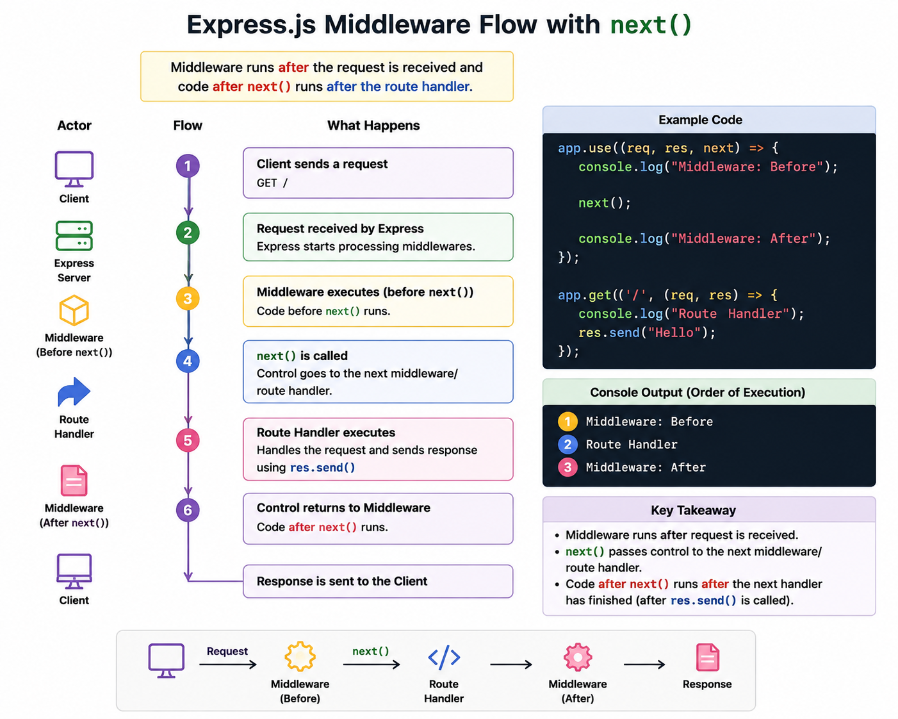

# Express 5 Middleware & Layered Architecture

A production-oriented Express 5 REST API demonstrating the middleware execution pipeline, layered architecture (Controller → Service), route-level validation middleware, custom `AppError` class, and environment-aware global error handling.

## Table of Contents

- [Key Features](#-key-features)
- [Tech Stack](#-tech-stack)
- [Architecture](#-architecture)
- [Interactive API Documentation (Swagger UI)](#-interactive-api-documentation-swagger-ui)
- [How Middleware Works](#-how-middleware-works)
- [What does express.json() do?](#-what-does-expressjson-do)
- [Event Listeners — res.on('finish')](#-event-listeners--resonfinish)
- [The Middleware Pipeline in This Project](#-the-middleware-pipeline-in-this-project)
- [Layered Architecture Deep Dive](#-layered-architecture-deep-dive)
- [Custom Error Handling](#-custom-error-handling)
- [API Reference](#-api-reference)
- [Prerequisites](#-prerequisites)
- [Getting Started](#-getting-started)
- [Available Scripts](#-available-scripts)
- [Environment Variables](#-environment-variables)
- [Key Concepts Summary](#-key-concepts-summary)

---

## 🚀 Key Features

- **Middleware pipeline** — Global request logger, route-level validation, and centralized error handling
- **Layered architecture** — Clean separation between Routes → Controllers → Services
- **Interactive Swagger UI** — Full OpenAPI 3.0.0 documentation & live endpoint testing at `/api-docs`
- **Custom `AppError` class** — Distinguishes operational errors from programming bugs
- **Environment-aware error responses** — Verbose stack traces in development, sanitized messages in production
- **Express 5 native async** — `throw` errors directly from `async` handlers; no `try/catch` or `next(err)` wrappers
- **Wildcard 404 catch-all** — `app.all("/*splat")` captures every unmatched route

---

## 🧰 Tech Stack

| Technology | Purpose |
|---|---|
| **Node.js** | JavaScript runtime |
| **Express 5** (`^5.2.1`) | Web framework with native async error propagation |
| **Swagger UI** (`swagger-ui-express`) | In-browser interactive OpenAPI 3.0.0 API explorer & tester |
| **ES Modules** | `"type": "module"` for native `import/export` |
| **Nodemon** | Auto-restart development server |
| **dotenv-free `.env`** | Node.js 20+ `--env-file` flag (no `dotenv` package needed) |

---

## 🏗 Architecture

### Directory Structure

```
middleware-execution/
├── server.js                          # App entry — mounts global middleware, routes & Swagger UI
├── swagger.json                       # Standalone OpenAPI 3.0.0 specification file
├── .env                               # Environment variables (NODE_ENV)
├── package.json                       # Dependencies & scripts
│
├── routes/
│   └── task.routes.js                 # Route definitions → maps HTTP verbs to controllers
│
├── controllers/
│   └── task.controller.js             # Request handling — validates params, delegates to service
│
├── services/
│   └── task.service.js                # Business logic — data operations, simulated DB delay
│
├── middleware/
│   ├── logger.middleware.js           # Global request logger (timestamp + method + URL)
│   ├── validate.middleware.js         # Route-level payload validation (title field)
│   └── globalErrorHandler.js          # Centralized 4-param error middleware (dev/prod modes)
│
└── utils/
    └── appError.js                    # Custom AppError class (statusCode + isOperational flag)
```

### Request Lifecycle

```
Client Request
      ↓
  express.json()          ← Parses JSON body into req.body
      ↓
  requestLogger           ← Logs "[timestamp] METHOD /url"
      ↓
  Router Matching          ← Finds matching route in task.routes.js
      ↓
  validateTaskPayload     ← (POST only) Checks title exists and is a valid string
      ↓
  Controller               ← Extracts params, calls Service, sends response
      ↓
  Service                  ← Performs business logic (CRUD on in-memory array)
      ↓
  Response OR Error
      ↓
  globalErrorHandler       ← Catches any thrown/next(err) errors, sends JSON error
```

---

## 📖 Interactive API Documentation (Swagger UI)

This API includes full interactive documentation powered by **Swagger UI** using an OpenAPI 3.0.0 specification (`swagger.json`).

### Accessing Swagger UI

Start the server (`npm run dev`) and visit:
```
http://localhost:3000/api-docs
```

### Features
- **Live Endpoint Testing**: Execute `GET`, `POST`, `PUT`, and `DELETE` requests directly from your browser without Postman.
- **Request & Response Schemas**: View required parameters, data types, query filters, and sample payloads.
- **Error Code Documentation**: Detailed visibility into `200`, `201`, `400` (validation), and `404` (not found) responses.

---

## 🔗 How Middleware Works

Middleware functions are the backbone of Express. They sit between the incoming request and the final route handler, forming a **pipeline** where each function can inspect, modify, or short-circuit the request/response cycle.



### The `next()` Function

Every middleware receives three arguments: `(req, res, next)`. Calling `next()` passes control to the **next** middleware or route handler in the stack. If you never call `next()`, the request hangs — the client never receives a response.

```javascript
// Global middleware — runs on every request
app.use((req, res, next) => {
  console.log("Middleware: Before");  // 1️⃣ Runs first
  next();                             // Passes control to route handler
  console.log("Middleware: After");   // 3️⃣ Runs after route handler finishes
});

app.get("/", (req, res) => {
  console.log("Route Handler");       // 2️⃣ Runs when next() is called
  res.send("Hello");
});
```

**Console output order:**
1. `Middleware: Before`
2. `Route Handler`
3. `Middleware: After`

### Types of Middleware

| Type | Signature | Registration | Purpose |
|---|---|---|---|
| **Application-level** | `(req, res, next)` | `app.use(fn)` | Runs on every request (logging, CORS, body parsing) |
| **Route-level** | `(req, res, next)` | `router.post("/", fn, handler)` | Runs only on specific routes (validation, auth) |
| **Error-handling** | `(err, req, res, next)` | `app.use(fn)` — **must have 4 params** | Catches errors from `throw` or `next(err)` |
| **Built-in** | — | `express.json()`, `express.static()` | Provided by Express itself |

> **Key Rule:** Middleware executes in the **order it is registered**. `app.use(A)` before `app.use(B)` means A always runs before B.

---

## 📦 What does `express.json()` do?

`express.json()` is built-in middleware that parses incoming requests with `Content-Type: application/json` and makes the parsed JavaScript object available as `req.body`.


### The Problem Without It

```javascript
app.post("/tasks", (req, res) => {
  console.log(req.body);  // ❌ undefined — Express doesn't parse JSON by default
});
```

### The Solution

```javascript
app.use(express.json());  // Register ONCE as global middleware

app.post("/tasks", (req, res) => {
  console.log(req.body);  // ✅ { title: "Learn Express", completed: false }
});
```

### How It Works Step by Step

1. **Client** sends a `POST` request with `Content-Type: application/json` and a JSON body string
2. **Express** receives the raw HTTP request with the body as a string: `'{"title":"Learn Express"}'`
3. **`express.json()` middleware** intercepts the request, calls `JSON.parse()` on the raw string, and attaches the result to `req.body`
4. **Route handler** accesses `req.body` as a regular JavaScript object: `{ title: "Learn Express" }`

> **Important:** It only works for requests with `Content-Type: application/json`. For form data, use `express.urlencoded({ extended: true })`.

---

## 📡 Event Listeners — `res.on('finish')`

The Express `res` (response) object is a Node.js writable stream that emits events. You can register event listeners on it to execute code **after** the response has been fully sent to the client.


### What is `res.on('finish', callback)`?

```javascript
app.use((req, res, next) => {
  const start = Date.now();

  res.on("finish", () => {
    const duration = Date.now() - start;
    console.log(`Request to ${req.url} took ${duration}ms`);
  });

  next();
});
```

- **`.on()` does NOT create the event** — it only registers a listener for a future event
- The `'finish'` event is emitted by Node.js when the response has been completely sent
- The callback executes **after** `res.send()` / `res.json()` / `res.end()` completes

### Event vs Listener vs Callback

| Term | Meaning | Example |
|---|---|---|
| **Event** | Something that happens | `'finish'` |
| **Listener** | Code that waits for an event | `res.on('finish', ...)` |
| **Callback** | The function that runs when the event occurs | `() => { /* runs when finish happens */ }` |

### Why Use It?

- **Request duration logging** — measure how long a request took without blocking the response
- **Cleanup tasks** — release resources after the response is sent
- **Analytics** — record response status codes and timing metrics

---

## 🔄 The Middleware Pipeline in This Project

This project registers middleware in a deliberate order inside `server.js`:

```javascript
// 1. Built-in JSON parser
app.use(express.json());

// 2. Custom request logger
app.use(requestLogger);

// 3. Route-specific middleware (validation) + controllers
app.use("/api/tasks", taskRoutes);

// 4. 404 catch-all for unmatched routes
app.all("/*splat", (req, res, next) => {
  next(new AppError(`Can't find ${req.originalUrl} on this server!`, 404));
});

// 5. Global error handler (MUST be last)
app.use(globalErrorHandler);
```

### Execution Order for `POST /api/tasks`

```
1. express.json()          → Parses body, req.body = { title: "New Task" }
2. requestLogger           → Logs "[2025-08-20T...] POST /api/tasks"
3. validateTaskPayload     → Checks req.body.title exists and is a string
4. createTask controller   → Calls taskService.createNewTask()
5. Response sent           → { success: true, data: { id: 3, title: "New Task" } }
```

### Execution Order for `POST /api/tasks` with Invalid Body

```
1. express.json()          → Parses body, req.body = {}
2. requestLogger           → Logs the request
3. validateTaskPayload     → ❌ title missing → next(new AppError(..., 400))
4. globalErrorHandler      → Sends { status: "fail", message: "Validation Error: ..." }
```

> **Notice:** The controller never executes when validation fails. The middleware short-circuits the pipeline by calling `next(error)` instead of `next()`.

---

## 🧅 Layered Architecture Deep Dive

The project separates concerns into three distinct layers:

### Routes → Controllers → Services

```
routes/task.routes.js          "What URL triggers what?"
        ↓
controllers/task.controller.js "What HTTP logic applies?"
        ↓
services/task.service.js       "What business logic runs?"
```

### Routes Layer (`task.routes.js`)

Maps HTTP verbs and URL patterns to controller functions. Can inject **route-level middleware** between the route and the controller:

```javascript
router.post("/", validateTaskPayload, createTask);
//                ^^^^^^^^^^^^^^^^^^^^  ^^^^^^^^^^
//                middleware (guard)    controller (handler)
```

### Controller Layer (`task.controller.js`)

- Extracts and validates HTTP-specific data (`req.params`, `req.body`, `req.query`)
- Delegates business logic to the Service layer
- Formats the HTTP response with a consistent envelope

```javascript
export const getTask = async (req, res) => {
  const taskId = Number(req.params.id);
  if (isNaN(taskId)) throw new AppError("Invalid Task ID. Must be a number.", 400);

  const task = await taskService.fetchTaskById(taskId);
  if (!task) throw new AppError("Task not found", 404);

  sendResponse(res, 200, task, "Task found");
};
```

> **Express 5 Advantage:** `throw new AppError(...)` inside an `async` handler is automatically caught and forwarded to the error middleware. No `try/catch` needed.

### Service Layer (`task.service.js`)

- Contains pure business logic (no `req`, `res`, or HTTP concepts)
- Manages the in-memory data store (simulates database operations)
- Uses `simulateDbCall()` to mimic async database latency

```javascript
export const createNewTask = async (title) => {
  await simulateDbCall();
  const newTask = {
    id: tasks.length ? Math.max(...tasks.map((t) => t.id)) + 1 : 1,
    title,
    completed: false,
  };
  tasks.push(newTask);
  return newTask;
};
```

### Why Separate Layers?

| Benefit | Explanation |
|---|---|
| **Testability** | Services can be unit-tested without HTTP overhead |
| **Reusability** | The same service can be called from controllers, CLI scripts, or cron jobs |
| **Single Responsibility** | Each layer has one job — routing, HTTP handling, or business logic |
| **Maintainability** | Changes to HTTP response format don't touch business logic |

---

## 🛡 Custom Error Handling

### The `AppError` Class (`utils/appError.js`)

```javascript
export class AppError extends Error {
  constructor(message, statusCode) {
    super(message);

    this.statusCode = statusCode;
    this.status = `${statusCode}`.startsWith("4") ? "fail" : "error";
    this.isOperational = true;

    Error.captureStackTrace(this, this.constructor);
  }
}
```

| Property | Purpose |
|---|---|
| `statusCode` | HTTP status code (`400`, `404`, `500`) |
| `status` | `"fail"` for 4xx client errors, `"error"` for 5xx server errors |
| `isOperational` | `true` = expected error (bad input, not found), safe to expose to client |
| `Error.captureStackTrace()` | Removes the `AppError` constructor from the stack trace for cleaner debugging |

### Global Error Handler (`middleware/globalErrorHandler.js`)

The error handler is a **4-parameter middleware** `(err, req, res, next)` — Express identifies it by the argument count. It operates in two modes:

#### Development Mode (`NODE_ENV=development`)

Returns the **full error object** with stack trace for debugging:

```json
{
  "status": "fail",
  "error": { /* full error object */ },
  "message": "Task not found",
  "stack": "AppError: Task not found\n    at getTask (file:///...)"
}
```

#### Production Mode (`NODE_ENV=production`)

Returns only the message for **operational** errors (safe for clients). For **programming** errors (bugs), returns a generic message:

```json
// Operational error (isOperational: true)
{ "status": "fail", "message": "Task not found" }

// Programming error (isOperational: false)
{ "status": "error", "message": "Something went very wrong!" }
```

### Built-in Error Type Handlers

The error handler also normalizes common database and authentication errors:

| Error Type | Source | Normalized Message |
|---|---|---|
| `CastError` | MongoDB/Mongoose invalid ID | `"Invalid [path]: [value]."` |
| Code `11000` | MongoDB duplicate key | `"Duplicate field '[field]' with value: '[value]'."` |
| `ValidationError` | Mongoose schema validation | `"Invalid input data. [errors]"` |
| `JsonWebTokenError` | JWT malformed/invalid | `"Invalid token. Please log in again!"` |
| `TokenExpiredError` | JWT expired | `"Your token has expired! Please log in again."` |

---

## 📡 API Reference

**Base URL:** `http://localhost:3000/api/tasks`

### Endpoints

| Method | Endpoint | Description | Middleware |
|---|---|---|---|
| `GET` | `/api/tasks` | Get all tasks (optional `?completed=true/false` filter) | Logger |
| `GET` | `/api/tasks/:id` | Get a single task by ID | Logger |
| `POST` | `/api/tasks` | Create a new task | Logger → **Validation** |
| `PUT` | `/api/tasks/:id` | Update a task | Logger |
| `DELETE` | `/api/tasks/:id` | Delete a task | Logger |

### Request & Response Examples

#### Create Task

```bash
curl -X POST http://localhost:3000/api/tasks \
  -H "Content-Type: application/json" \
  -d '{"title": "Learn Middleware"}'
```

**Response (201):**

```json
{
  "success": true,
  "message": "Task created successfully",
  "data": {
    "id": 3,
    "title": "Learn Middleware",
    "completed": false
  }
}
```

#### Validation Error

```bash
curl -X POST http://localhost:3000/api/tasks \
  -H "Content-Type: application/json" \
  -d '{}'
```

**Response (400):**

```json
{
  "status": "fail",
  "message": "Validation Error: 'title' is required and must be a valid string."
}
```

#### 404 Not Found

```bash
curl http://localhost:3000/api/unknown
```

**Response (404):**

```json
{
  "status": "fail",
  "message": "Can't find /api/unknown on this server!"
}
```

#### Malformed JSON Payload (Development Mode)

```bash
curl -X POST http://localhost:3000/api/tasks \
  -H "Content-Type: application/json" \
  -d '{ "title": "Incomplete'
```

**Response (400):**

```json
{
  "status": "fail",
  "error": {
    "statusCode": 400,
    "type": "entity.parse.failed"
  },
  "message": "Invalid JSON syntax in request body.",
  "stack": "SyntaxError: ..."
}
```

---

## 🛠 Prerequisites

- [Node.js](https://nodejs.org/) (v24+ recommended)
- npm (Node Package Manager)

---

## 🏁 Getting Started

### 1. Install Dependencies

```bash
cd middleware-execution
npm install
```

### 2. Start Development Server

```bash
npm run dev
```

This uses Nodemon with `--env-file=.env` to auto-load environment variables and restart on file changes.

### 3. Test the API

```bash
# Get all tasks
curl http://localhost:3000/api/tasks

# Create a task
curl -X POST http://localhost:3000/api/tasks \
  -H "Content-Type: application/json" \
  -d '{"title": "Test Middleware Pipeline"}'
```

---

## 📋 Available Scripts

| Command | Description |
|---|---|
| `npm start` | Start the server with `node server.js` |
| `npm run dev` | Start with Nodemon + `.env` auto-loading for hot reload |

---

## 🔐 Environment Variables

| Variable | Description | Default |
|---|---|---|
| `NODE_ENV` | Application environment (`development` or `production`) | `development` |

- **`development`** — Error responses include the full error object and stack trace
- **`production`** — Error responses are sanitized; only operational error messages are exposed

The `.env` file is loaded via Node.js `--env-file` flag (no `dotenv` dependency required).

---

## 🔑 Key Concepts Summary

| Concept | What It Means |
|---|---|
| **Middleware** | A function `(req, res, next)` that intercepts requests before they reach the route handler |
| **`next()`** | Passes control to the next middleware/route handler in the stack |
| **`next(error)`** | Skips all remaining middleware and jumps directly to the error handler |
| **Route-level middleware** | Middleware injected into a specific route: `router.post("/", validate, create)` |
| **Error middleware** | A 4-parameter function `(err, req, res, next)` — Express recognizes it by argument count |
| **`express.json()`** | Built-in middleware that parses JSON request bodies into `req.body` |
| **`res.on('finish')`** | Event listener that executes a callback after the response is fully sent |
| **Operational error** | Expected error (bad input, not found) — safe to show to the client |
| **Programming error** | Unexpected bug — hidden from the client in production |
| **`app.all("/*splat")`** | Express 5 wildcard catch-all that matches any unmatched route |
| **Layered architecture** | Routes → Controllers → Services separation for testability and maintainability |
| **`Error.captureStackTrace()`** | Removes the custom error constructor from the stack trace for cleaner debugging |
