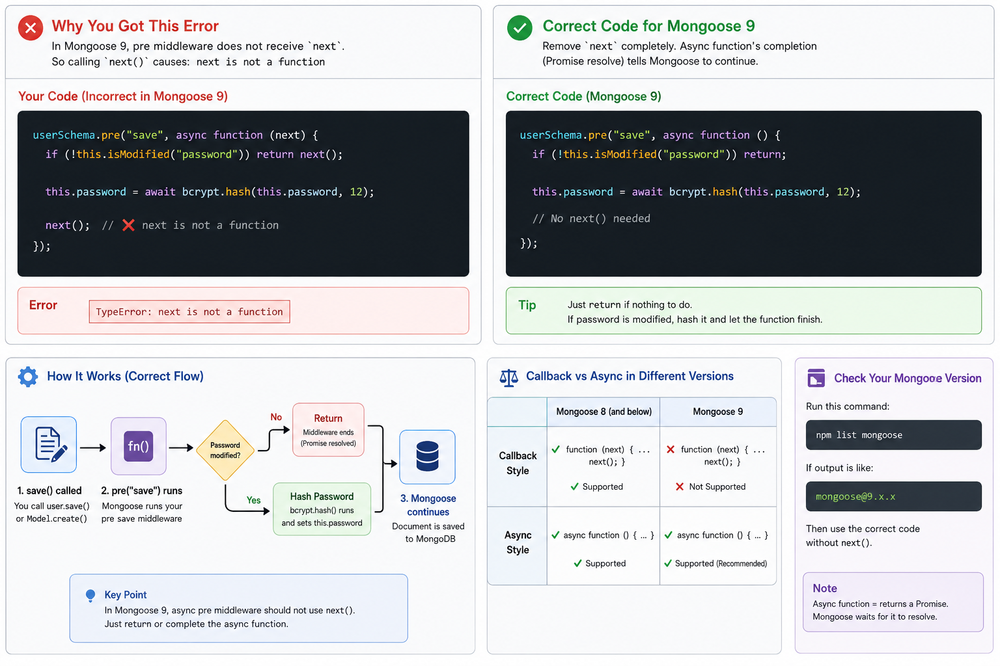

# User Registration API — bcrypt Password Hashing & Pre-Save Hooks

A production-structured Express 5 REST API implementing **secure user registration** with automatic password hashing. This project introduces **bcryptjs** for one-way password hashing, Mongoose **`pre("save")` middleware hooks** for transparent hashing before database writes, **`select: false`** to prevent password leaks in queries, **Joi password strength validation** (minimum length + letter + digit pattern), and **application-level duplicate email checking** before insert.

---

## Table of Contents

- [Key Features](#-key-features)
- [Tech Stack](#-tech-stack)
- [Architecture](#-architecture)
  - [Directory Structure](#directory-structure)
  - [Registration Request Flow](#registration-request-flow)
- [User Model — Password Security](#-user-model--password-security)
  - [Schema Definition](#schema-definition)
  - [select: false — Password Leak Prevention](#select-false--password-leak-prevention)
  - [pre("save") Hook — Automatic Hashing](#presave-hook--automatic-hashing)
  - [Why 12 Salt Rounds?](#why-12-salt-rounds)
- [Registration Service — Defense in Depth](#-registration-service--defense-in-depth)
  - [Duplicate Email Check](#duplicate-email-check)
  - [Password Stripping with .toObject()](#password-stripping-with-toobject)
- [Joi Validation — Password Strength](#-joi-validation--password-strength)
- [Centralized Error Handling](#-centralized-error-handling)
- [API Reference](#-api-reference)
- [Prerequisites](#-prerequisites)
- [Getting Started](#-getting-started)
- [Available Scripts](#-available-scripts)
- [Environment Variables](#-environment-variables)
- [Key Concepts Summary](#-key-concepts-summary)

---

## 🚀 Key Features

- **bcrypt Password Hashing** — Passwords are one-way hashed with `bcryptjs` (cost factor 12) before storage
- **Pre-Save Middleware Hook** — `userSchema.pre("save")` automatically hashes passwords, keeping controllers and services clean
- **`isModified("password")` Guard** — Prevents re-hashing an already-hashed password during non-password updates
- **`select: false` on Password** — Password hash is excluded from all query results by default
- **`.toObject()` + `delete`** — Manually strips password from `User.create()` responses (which bypass `select: false`)
- **Joi Password Strength** — Regex pattern enforces at least one letter + one number in addition to minimum length
- **Application-Level Duplicate Check** — `findOne({ email })` before `create()` provides clean `400` errors
- **JWT Dependencies Installed** — `jsonwebtoken` package ready for login implementation in future sessions

---

## 🧰 Tech Stack

| Technology                  | Purpose                                             |
| --------------------------- | --------------------------------------------------- |
| **Node.js**                 | JavaScript runtime (v24+ recommended)               |
| **Express 5** (`^5.2.1`)   | Web framework with native async error propagation   |
| **Mongoose 9** (`^9.9.4`)  | MongoDB ODM — schemas, hooks, query chaining        |
| **bcryptjs** (`^3.0.3`)    | One-way password hashing with configurable salt rounds |
| **jsonwebtoken** (`^9.0.3`) | JWT token generation (installed for future use)     |
| **Joi** (`^18.2.5`)        | Declarative request body validation with regex patterns |
| **ES Modules**              | Native `"type": "module"` (`import`/`export`)       |
| **Nodemon**                 | Hot-reloading development server with `--env-file`  |

---

## 🏗 Architecture

### Directory Structure

```
authentication/
├── server.js                         # App entry — MongoDB connect-then-listen
├── .env                              # Environment variables (NODE_ENV, MONGO_URI)
├── package.json                      # Dependencies (bcryptjs, jsonwebtoken, joi)
│
├── models/
│   └── user.model.js                 # ★ User schema + pre("save") bcrypt hook
│
├── validations/
│   └── auth.validation.js            # ★ Joi registerSchema with password regex
│
├── middleware/
│   ├── validate.middleware.js        # Reusable Joi factory: validate(schema) → middleware
│   ├── logger.middleware.js          # ISO timestamp request logger
│   └── globalErrorHandler.js         # Centralized error handler (DB + JWT errors)
│
├── routes/
│   └── auth.routes.js                # POST /register with Joi validation
│
├── controllers/
│   └── auth.controller.js            # Thin controller — delegates to auth.service
│
├── services/
│   └── auth.service.js               # ★ Duplicate check + create + password strip
│
└── utils/
    └── appError.js                   # Custom AppError class (statusCode + isOperational)
```

### Registration Request Flow

```
Client POST /api/auth/register
  │
  ▼
express.json() → requestLogger
  │
  ▼
validate(registerSchema)              ← Joi: name, email format, password strength
  │                                      (reject if password < 8 chars or no letter+digit)
  ▼
auth.controller.register()
  │
  ▼
auth.service.registerUser()
  │
  ├── 1. User.findOne({ email })      ← Application-level duplicate check
  │       ↓ (if exists)
  │       throw AppError(400)
  │
  ├── 2. User.create(userData)        ← Triggers pre("save") hook
  │       │
  │       ▼
  │   pre("save") middleware
  │       ├── isModified("password")? ← Guard: skip if password unchanged
  │       └── bcrypt.hash(pw, 12)     ← Hash with 12 salt rounds
  │       │
  │       ▼
  │   MongoDB Insert (hashed password stored)
  │
  ├── 3. newUser.toObject()           ← Convert Mongoose doc to plain object
  │
  └── 4. delete userResponse.password ← Strip password from response
          │
          ▼
  res.status(201).json({ success, message, data })
```

---

## 🔐 User Model — Password Security

### Schema Definition

```javascript
import mongoose from "mongoose";
import bcrypt from "bcryptjs";

const userSchema = new mongoose.Schema(
  {
    name: {
      type: String,
      required: [true, "Please tell us your name!"],
      trim: true,
    },
    email: {
      type: String,
      required: [true, "Please provide your email address."],
      unique: true,
      lowercase: true,
    },
    password: {
      type: String,
      required: [true, "A password is required for security."],
      minlength: [8, "Password must be at least 8 characters long."],
      select: false, // ★ Never returned in query results
    },
  },
  { timestamps: true },
);
```

---

### `select: false` — Password Leak Prevention

By default, Mongoose includes all fields in query results. Setting `select: false` on the password field ensures the hash is **never accidentally exposed** in API responses:

```javascript
password: {
  type: String,
  required: [true, "A password is required for security."],
  minlength: [8, "Password must be at least 8 characters long."],
  select: false, // ★ Excluded from all queries by default
},
```

| Query | Returns Password? | Why |
| --- | --- | --- |
| `User.find()` | ❌ No | `select: false` excludes it |
| `User.findById(id)` | ❌ No | `select: false` excludes it |
| `User.findOne({ email })` | ❌ No | `select: false` excludes it |
| `User.findById(id).select("+password")` | ✅ Yes | Explicit `+` override for login |
| `User.create(data)` | ✅ Yes | Returns the full saved document (bypasses `select`) |

> **Important:** `User.create()` returns the document as saved, **bypassing `select: false`**. This is why the service must manually strip the password before returning the response.

---

### `pre("save")` Hook — Automatic Hashing

The Mongoose middleware hook intercepts every `.save()` and `.create()` call to hash the password transparently:

```javascript
userSchema.pre("save", async function () {
  // Guard: Only hash if the password field was actually changed
  if (!this.isModified("password")) return;

  // Hash with cost factor 12 (2^12 = 4096 iterations)
  this.password = await bcrypt.hash(this.password, 12);
});
```

| Concept | Purpose |
| --- | --- |
| `pre("save")` | Runs **before** every `.save()` and `.create()` call |
| `this` keyword | Refers to the document being saved (arrow functions won't work here) |
| `this.isModified("password")` | Returns `true` only if the password field was changed |
| `bcrypt.hash(password, 12)` | Generates a unique salt and hashes the password with 12 rounds |

> **Why `function()` instead of `() =>`?** Arrow functions don't have their own `this` context. Mongoose hooks require `function()` syntax so `this` refers to the document being saved.

#### Mongoose 9 — `next()` is No Longer Needed

In Mongoose 9, async `pre` middleware no longer receives a `next` parameter. The function's Promise resolution signals completion to Mongoose. Calling `next()` throws `TypeError: next is not a function`.



---

### Why 12 Salt Rounds?

The salt round number controls how computationally expensive the hash is to generate:

| Salt Rounds | Iterations (2^n) | Approximate Time | Use Case |
| --- | --- | --- | --- |
| 10 | 1,024 | ~80ms | Development, low-security apps |
| **12** | **4,096** | **~250ms** | **Production standard (recommended)** |
| 14 | 16,384 | ~1s | High-security applications |
| 16 | 65,536 | ~4s | Extremely sensitive data |

> Higher rounds = slower hashing = harder to brute-force. **12 is the industry standard** for production applications — slow enough to resist attacks, fast enough to not block your server.

---

## 🛡️ Registration Service — Defense in Depth

### Duplicate Email Check

Before calling `User.create()`, the service explicitly checks for existing accounts:

```javascript
import { User } from "../models/user.model.js";
import { AppError } from "../utils/appError.js";

export const registerUser = async (userData) => {
  // 1. Application-level check — clean error message
  const existingUser = await User.findOne({ email: userData.email });
  if (existingUser) {
    throw new AppError("An account with this email already exists", 400);
  }

  // 2. Create user — triggers pre("save") hook for hashing
  const newUser = await User.create(userData);

  // 3. Strip password from the response
  const userResponse = newUser.toObject();
  delete userResponse.password;

  return userResponse;
};
```

| Defense Layer | How It Works |
| --- | --- |
| **Joi `.email()`** | Validates email format before the route handler |
| **`findOne({ email })`** | Application-level check returns a clean `AppError(400)` |
| **`unique: true`** | MongoDB B-Tree index — ultimate safety net against race conditions |
| **`globalErrorHandler`** | Catches `code: 11000` as a fallback and normalizes to `400` |

---

### Password Stripping with `.toObject()`

`User.create()` returns the full Mongoose document **including the password hash**, because `select: false` only applies to queries — not to the document returned by `.create()`:

```javascript
// User.create() returns { _id, name, email, password: "$2a$12...", ... }
const newUser = await User.create(userData);

// Convert to plain JS object first (required for delete to work on Mongoose docs)
const userResponse = newUser.toObject();

// Now safely remove the password hash
delete userResponse.password;

return userResponse;
// Returns { _id, name, email, createdAt, updatedAt }
```

| Step | Why It's Needed |
| --- | --- |
| `.toObject()` | Converts Mongoose document to a plain JavaScript object (Mongoose docs have immutable getters) |
| `delete userResponse.password` | Removes the password hash so it's never sent to the client |

---

## ✅ Joi Validation — Password Strength

The registration schema enforces **email format** and **password strength** before the request reaches the controller:

```javascript
import Joi from "joi";

export const registerSchema = Joi.object({
  name: Joi.string().min(2).max(50).required(),
  email: Joi.string().email().required(),

  // Require at least 8 chars, one letter, and one number
  password: Joi.string()
    .min(8)
    .pattern(new RegExp("^(?=.*[A-Za-z])(?=.*\\d)"))
    .required()
    .messages({
      "string.pattern.base":
        "Password must contain at least one letter and one number.",
    }),
});
```

| Rule | What It Enforces | Example Pass | Example Fail |
| --- | --- | --- | --- |
| `.min(8)` | Minimum 8 characters | `"hello123"` | `"hi1"` |
| `.pattern(...)` | At least one letter + one digit | `"Pass1234"` | `"abcdefgh"` |
| `.email()` | Valid RFC 5322 email format | `"user@mail.com"` | `"not-an-email"` |

**Regex Breakdown:** `^(?=.*[A-Za-z])(?=.*\d)`

| Part | Meaning |
| --- | --- |
| `^` | Start of string |
| `(?=.*[A-Za-z])` | Lookahead: at least one letter (upper or lower) anywhere |
| `(?=.*\d)` | Lookahead: at least one digit anywhere |

---

## 🚨 Centralized Error Handling

The global error handler normalizes database and JWT errors into clean JSON responses:

| Error Type | Trigger | Normalized Response |
| --- | --- | --- |
| **`CastError`** | Invalid ObjectId format | `"Invalid _id: abc."` (400) |
| **`code: 11000`** | Duplicate value on `unique` field | `"Duplicate field 'email' with value: '...'."` (400) |
| **`ValidationError`** | Schema constraint violation | `"Invalid input data. ..."` (400) |
| **`JsonWebTokenError`** | Invalid JWT token | `"Invalid token. Please log in again!"` (401) |
| **`TokenExpiredError`** | Expired JWT token | `"Your token has expired! Please log in again."` (401) |
| **JSON Parse Error** | Malformed JSON in body | `"Invalid JSON syntax in request body."` (400) |
| **`AppError`** | Custom application error | Original message with appropriate status code |

---

## 📡 API Reference

### Auth Endpoints — `http://localhost:3000/api/auth`

| Method | Endpoint             | Description       | Validation       |
| ------ | -------------------- | ----------------- | ---------------- |
| `POST` | `/api/auth/register` | Register new user | `registerSchema` |

### Request & Response Examples

#### Register a New User

```bash
curl -X POST http://localhost:3000/api/auth/register \
  -H "Content-Type: application/json" \
  -d '{"name": "Alex", "email": "alex@example.com", "password": "MyPass123"}'
```

**Success (201 Created):**

```json
{
  "success": true,
  "message": "Registration successful",
  "data": {
    "_id": "64abc123...",
    "name": "Alex",
    "email": "alex@example.com",
    "createdAt": "2026-09-02T...",
    "updatedAt": "2026-09-02T...",
    "__v": 0
  }
}
```

> **Note:** The password hash is **not** included in the response — it was stripped by the service layer.

#### Duplicate Email Error (400)

```json
{
  "status": "fail",
  "message": "An account with this email already exists"
}
```

#### Weak Password Error (400)

```json
{
  "status": "fail",
  "message": "Validation Error: Password must contain at least one letter and one number."
}
```

---

## 🛠 Prerequisites

- [Node.js](https://nodejs.org/) (v24+ recommended)
- [MongoDB](https://www.mongodb.com/) (local installation or [MongoDB Atlas](https://www.mongodb.com/atlas) cloud cluster)
- npm (Node Package Manager)

---

## 🏁 Getting Started

### 1. Navigate to Project Directory

```bash
cd authentication
```

### 2. Install Dependencies

```bash
npm install
```

### 3. Configure Environment

Update the `.env` file:

```env
NODE_ENV=development
MONGO_URI=mongodb://localhost:27017/auth
```

### 4. Start Development Server

```bash
npm run dev
```

### 5. Test Registration

```bash
curl -X POST http://localhost:3000/api/auth/register \
  -H "Content-Type: application/json" \
  -d '{"name": "Alice", "email": "alice@example.com", "password": "Secure1234"}'
```

---

## 📋 Available Scripts

| Command       | Description                                                                    |
| ------------- | ------------------------------------------------------------------------------ |
| `npm start`   | Start server with Node.js (`node --env-file=.env server.js`)                   |
| `npm run dev` | Start development server with hot-reload (`nodemon --env-file=.env server.js`) |

---

## 🔐 Environment Variables

| Variable    | Description                                     | Default                              |
| ----------- | ----------------------------------------------- | ------------------------------------ |
| `NODE_ENV`  | Application mode (`development` / `production`) | `development`                        |
| `MONGO_URI` | MongoDB connection string                       | `mongodb://localhost:27017/auth`     |

---

## 🔑 Key Concepts Summary

| Concept                        | Description                                                                                |
| ------------------------------ | ------------------------------------------------------------------------------------------ |
| **bcrypt hashing**             | One-way password hashing — the original password cannot be recovered from the hash         |
| **Salt rounds (cost factor)**  | Controls computational cost; 12 = 4,096 iterations (production standard)                   |
| **`pre("save")` hook**         | Mongoose middleware that runs before every `.save()` and `.create()` call                   |
| **`this.isModified("field")`** | Guard that prevents re-hashing when the password field hasn't changed                      |
| **`function()` vs `() =>`**   | Hooks require `function()` syntax so `this` refers to the document being saved             |
| **`select: false`**            | Excludes the field from all query results by default                                       |
| **`select("+password")`**      | Explicitly overrides `select: false` to include the password (used for login)              |
| **`.toObject()`**              | Converts a Mongoose document to a plain JavaScript object (allows `delete` to work)        |
| **`User.create()` vs queries** | `.create()` returns the full document (including `select: false` fields); queries do not    |
| **Password strength regex**    | `^(?=.*[A-Za-z])(?=.*\d)` — lookaheads ensure at least one letter and one digit            |
| **Defense in depth**           | Joi → `findOne()` → `unique: true` → `globalErrorHandler` — four layers of protection     |
| **`unique: true`**             | MongoDB B-Tree index — database-level uniqueness constraint (safety net for race conditions) |
